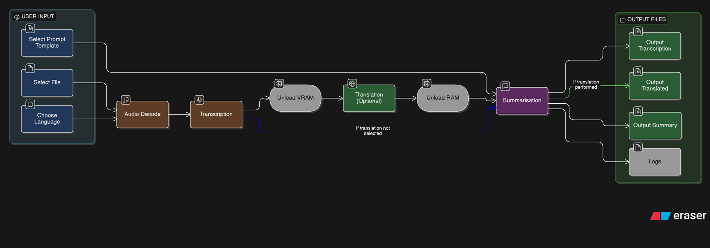
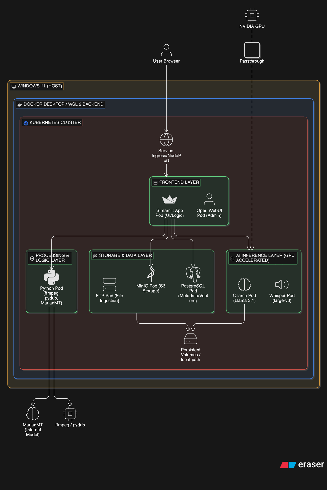
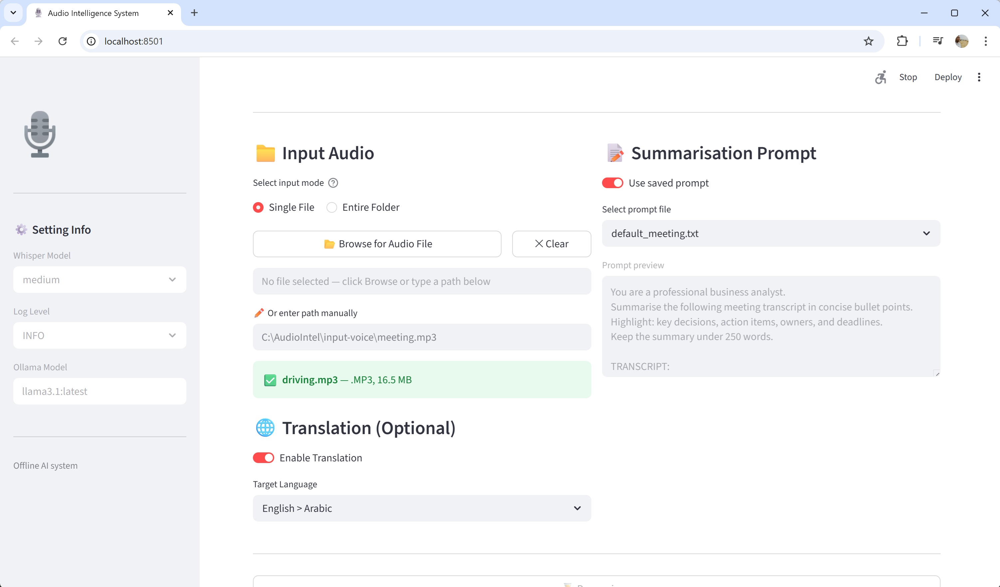
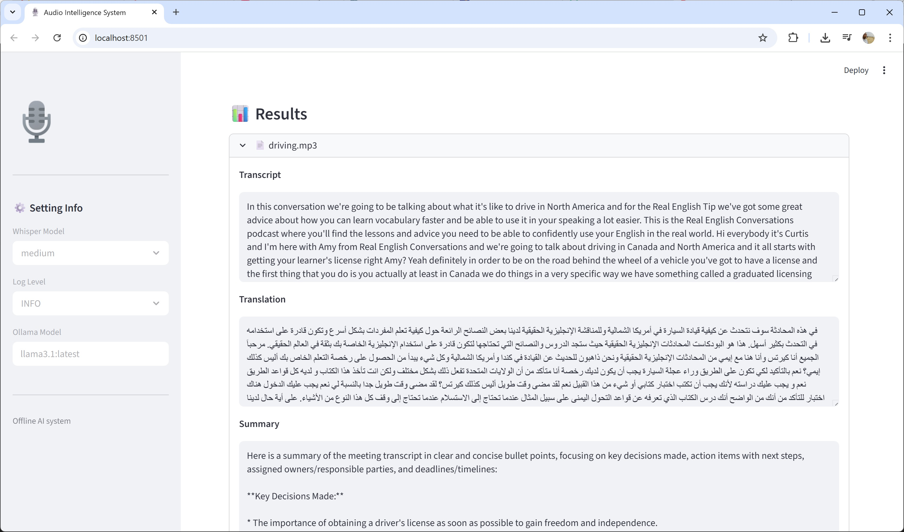
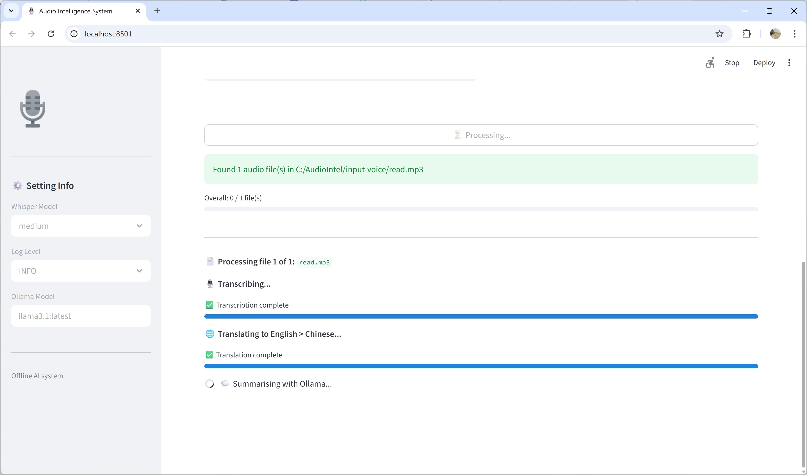
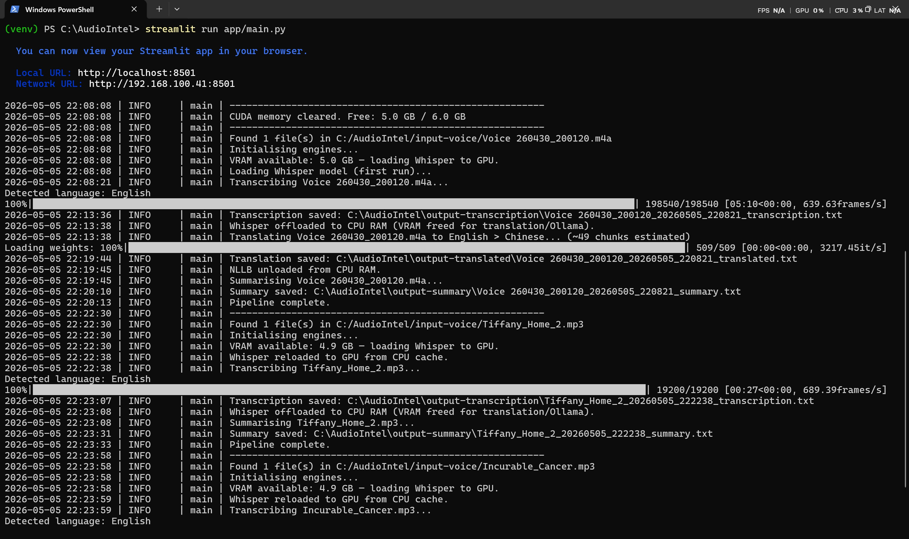

# 🎙️ Audio Intelligence System

> **Home Lab POC - Local offline capable AI pipeline for voice transcription, multilingual translation and summarisation.**

---

## Table of Contents

- [Overview](#overview)
- [Business Requirements](#business-requirements)
- [Technical Requirements](#technical-requirements)
- [Pipeline Flow](#pipeline-flow)
- [Key Software Stack](#key-software-stack)
- [Configuration](#configuration)
- [Output Formats](#output-formats)
- [Supported Languages](#supported-languages)
- [Logging](#logging)
- [Known Limitations](#known-limitations)
- [Future Roadmap - SaaS & Kubernetes](#future-roadmap--saas--kubernetes)

---

## Overview

Audio Intelligence System is a fully self-contained AI pipeline that ingests raw voice recordings, converts speech to structured text, optionally translates into a target language, and generates a concise business-ready summary — all running **locally on the user's air-gapped machine with no cloud dependency**.

The system is designed for business professionals who handle sensitive audio content such as meetings, client calls, training sessions, and interviews, where data privacy and offline capability are non-negotiable requirements.

---

## Business Requirements

### Core Capabilities

- **Voice-to-text transcription** of real-world audio recordings including meetings, interviews, client calls, lectures, and training sessions across all common audio formats (MP3, WAV, FLAC, M4A, OGG, WMA, AAC).

- **Multilingual translation** of transcribed content into Bahasa Melayu, Simplified Chinese, Arabic, French, German and many more — supporting multilingual business environments without relying on cloud translation APIs.

- **AI-powered summarisation** using a locally hosted large language model to distil long transcripts into structured, actionable summaries with key decisions, action items, owners, and deadlines.

- **Configurable prompt templates** allowing different business units to define their own summarisation style — meeting minutes, client call reports, training recaps, compliance records.

- **Structured transcript output** with timestamps, detected speaker turns, detected language, duration, and plain-text sections — suitable for archiving, review, and downstream processing.

### Non-Functional Requirements

- **Data privacy** — all audio, transcription, translation, and summarisation remain on the local machine. No data is transmitted to internet or external servers at any point during operation.

- **Air-gap capability** — once set up, the system operates fully offline. All model weights, Python packages, and application code are stored locally.

- **Business usability** — a non-technical user must be able to operate the system through a browser interface without any command-line interaction.

- **Auditability** — all pipeline activity is written to rotating log files with configurable verbosity levels.

- **Reproducibility** — configuration is centralised in a single YAML file. Outputs are timestamped and organised into dedicated folders.

---

## Technical Requirements

### Hardware (Minimum — Verified)

| Component | Specification |
|---|---|
| CPU | Intel Core i7-13700H (or equivalent, 8+ cores) |
| RAM | 16 GB DDR5 (minimum — 64 GB recommended for larger models) |
| GPU | NVIDIA RTX 4050, 6 GB VRAM (CUDA Compute 8.9) |
| Storage | 20 GB free (models + packages + outputs) |
| OS | Windows 11 Home or Pro |

### Hardware (Recommended — High-Throughput)

| Component | Specification |
|---|---|
| CPU | AMD Ryzen 9 (16+ cores) |
| RAM | 64 GB DDR5 |
| GPU | NVIDIA RTX 5090, 32 GB GDDR7 (CUDA Compute 12.0) |
| Storage | 100 GB NVMe SSD |

### Software Prerequisites

| Software | Version | Purpose |
|---|---|---|
| Python | 3.12.x | Application runtime (3.14 not supported — no CUDA wheels) |
| CUDA Toolkit | 12.8+ | GPU acceleration for Whisper |
| NVIDIA Driver | 566.03+ | Required for stable Blackwell/Ada GPU operation |
| FFmpeg | Latest | Audio decoding and format conversion |
| Ollama | 0.21+ | Local LLM inference server |

---

## Pipeline Flow



### Memory Management Sequence

The RTX 4050 (6 GB VRAM) is shared between Whisper and Ollama. The pipeline enforces a strict load/unload sequence to prevent out-of-memory crashes:

```
Whisper loads (1.5 GB VRAM)
    → transcribe
    → unload() — VRAM freed

NLLB-200 loads (CPU-only, 2.4 GB RAM)
    → translate
    → unload() — RAM freed

Ollama loads mistral (4.4 GB VRAM)
    → summarise
    → release() — VRAM freed immediately
```

---

## Key Software Stack

### Whisper — Speech-to-Text

[OpenAI Whisper](https://github.com/openai/whisper) is an open-source automatic speech recognition model trained on 680,000 hours of multilingual audio. It runs entirely locally on the GPU using CUDA acceleration.

| Model | Parameters | VRAM | Notes |
|---|---|---|---|
| `tiny` | 39M | ~0.4 GB | Testing only |
| `base` | 74M | ~0.6 GB | Fast, lower accuracy |
| `small` | 244M | ~0.9 GB | Good balance |
| `medium` | 769M | ~1.5 GB | **Default — recommended** |
| `large-v3` | 1550M | ~3.0 GB | Best accuracy — use on RTX 5090+ |

Key capabilities used: word timestamps, speaker pause detection, automatic language detection, FP16 inference on CUDA.

---

### NLLB-200 — Neural Machine Translation

[facebook/nllb-200-distilled-600M](https://huggingface.co/facebook/nllb-200-distilled-600M) is Meta AI's No Language Left Behind model, supporting 200 languages with production-quality translations. It runs on CPU to preserve VRAM for Whisper and Ollama.

Selected over Helsinki-NLP MarianMT because: MarianMT's `opus-mt-en-ms` (English→Malay) model was removed from Hugging Face Hub, and the multilingual fallback (`opus-mt-en-mul`) produced severely degraded Malay output. NLLB-200 natively supports Bahasa Melayu (`zsm_Latn`) with high quality.

Translation uses sentence-aware chunking — text is split on sentence boundaries rather than fixed character counts to preserve contextual coherence across chunk boundaries.

---

### Ollama — Local LLM Inference

[Ollama](https://ollama.com) serves large language models locally via a REST API, eliminating any cloud dependency for summarisation. It automatically detects and uses the NVIDIA GPU.

| Model | Size | RAM Required | Quality |
|---|---|---|---|
| `mistral:latest` | 4.4 GB | ~5 GB | **Default — recommended for RTX 4050** |
| `llama3.1:latest` | 4.9 GB | ~6 GB | Higher quality, tight on 16 GB system |
| `llama3.1:70b` | ~42 GB | ~48 GB | Best quality — requires 64 GB RAM |

Prompt templates are stored as plain `.txt` files in `prompt-summary/` and can be customised per business unit without any code changes.

---

### Streamlit — Browser UI

[Streamlit](https://streamlit.io) provides the browser-based interface running at `http://localhost:8501`. Key UX features implemented:

- Native Windows OS file picker dialog (via tkinter) — no manual path typing required
- Real-time progress bars for transcription (segment-level) and translation (chunk-level)
- Run button locks during processing — prevents duplicate pipeline submissions
- Results persist in session state — survive widget interactions and reruns
- All outputs displayed inline with expandable panels per file

---

### Triton Windows — GPU Kernel Acceleration

[triton-windows](https://pypi.org/project/triton-windows/) is the Windows-compatible build of OpenAI Triton, required for Whisper's Dynamic Time Warping word-timestamp alignment to use the GPU fast path. The standard `triton` package is Linux-only and produces a `Failed to launch Triton kernels` warning on Windows without this replacement.

---

## Configuration

All system behaviour is controlled through [config.yaml](config.yaml). No code changes are required for common adjustments.

---

## Output Formats

### Transcription Report (`output-transcription/`)
Detail conversation with speakers identification, timestamp and brief header

[Sample transcription report](output-transcription/Homeless_In_Athens_1B_20260427_212106_transcription.txt)

### Translation (`output-translated/`)
Plain translated text, sentence-chunked and reassembled.

[Sample translated output](output-translated/Ninja_Teacher_20260428_093825_translated.txt)

### Summary (`output-summary/`)
LLM-generated structured summary following the selected prompt template — typically bullet-point format with decisions, action items, owners, and deadlines.

[Sample summary](output-summary/Ninja_Teacher_20260428_093825_summary.txt)

---

## Supported Languages

### Audio Input (Auto-Detected by Whisper)
Whisper supports 99 languages for transcription including English, Malay, Mandarin, Arabic, French, German, Japanese, Korean, Spanish, Hindi, and more.

### Translation Output (NLLB-200)

| Code | Language |
|---|---|
| `zsm_Latn` | Bahasa Melayu |
| `zho_Hans` | Chinese (Simplified) |
| `arb_Arab` | Modern Standard Arabic |
| `fra_Latn` | French |
| `deu_Latn` | German |
| `ind_Latn` | Indonesian |
| `jpn_Jpan` | Japanese |
| `kor_Hang` | Korean |

Additional pairs can be added to `config.yaml` without code changes, provided the NLLB model files are present locally.

---

## Logging

Logs are written to `logs/` with automatic rotation (10 MB per file, 5 backups retained).

[Sample logs](logs/streamlit_run.log)

---

## Known Limitations

| Limitation | Detail | Workaround |
|---|---|---|
| Python 3.14 not supported | No CUDA PyTorch wheels exist for cp314 | Use Python 3.12 exclusively |
| Whisper progress is post-hoc | Progress bar replays after inference completes, not during | Planned: migrate to `faster-whisper` for real-time progress |
| NLLB on CPU only | RTX 4050 VRAM is shared with Whisper and Ollama | Acceptable; NLLB runs well on CPU for business-length audio |
| Translation time scales linearly | 12-min audio ≈ 29 chunks ≈ 8–10 min translation on CPU | Reduce `beam_size` to 2; increase `chunk_size` to 1024 |
| Speaker diarisation is heuristic | Speaker turns detected by pause gaps, not voice fingerprinting | Planned: integrate pyannote-audio for true speaker ID |

---

## Future Roadmap - SaaS & Kubernetes

The system is architecturally designed to migrate from a local desktop deployment to a containerised, multi-tenant SaaS platform. The planned Kubernetes architecture is illustrated below.

### Target Architecture



### Planned SaaS Microservices Kubernetes Enhancements

| Feature | Technology | Status |
|---|---|---|
| Containerised deployment | Docker + Kubernetes | Planned |
| GPU passthrough to pods | NVIDIA Device Plugin for K8s | Planned |
| S3-compatible file storage | MinIO | Planned |
| Metadata and vector storage | PostgreSQL + pgvector | Planned |
| Multi-user job queue | Kubernetes Jobs + Redis | Planned |
| File ingestion via FTP/SFTP | ProFTPD pod | Planned |
| Admin UI | Open WebUI | Planned |
| Real-time transcription progress | faster-whisper generator API | Planned |
| True speaker diarisation | pyannote-audio | Planned |
| REST API for external integration | FastAPI sidecar | Planned |
| Folder / batch mode (stable) | Async job queue | v2.1 |

### Migration Path

The current codebase is intentionally modular — `transcriber.py`, `translator.py`, and `summariser.py` are stateless service classes that map directly to individual Kubernetes pods. The migration path is:

1. **Containerise each module** as a separate Docker image
2. **Replace local file I/O** with MinIO S3 SDK calls
3. **Replace `st.session_state`** with a Redis job queue for multi-user support
4. **Expose Whisper and Ollama** as internal ClusterIP services with GPU node affinity
5. **Add Ingress** for external HTTPS access with authentication

---

## Screenshots

### Single page browser based UI with file picker, translation options, summarization prompt and status









